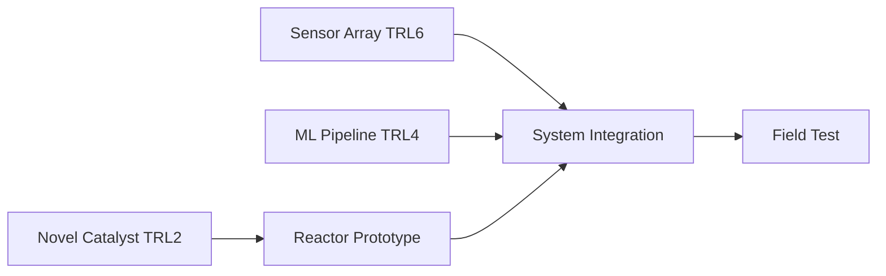
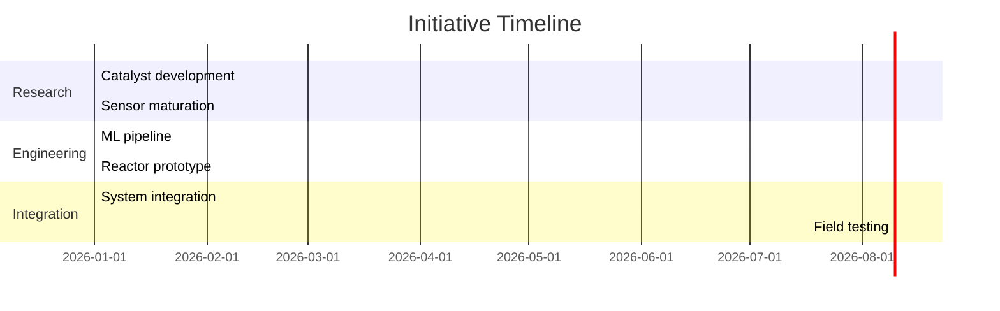

# Analysis Patterns for Stress-Testing Research Initiatives

> Agent reference for Heilmeier Catechism Phase 5 (Stress Testing).
> Read this when selecting and executing analyses to validate an initiative.
>
> Each pattern has three implementation tiers:
> 1. **Structured reasoning** — Markdown tables and diagrams. Always available.
> 2. **Computational** — Python with specific libraries. Generate bespoke code if environment supports it.
> 3. **Heavy-duty** — External tools for beyond-session analysis.

---

## Pattern 1: Feasibility Envelope Analysis

**When to use:** Determining whether the initiative's goals are achievable
within known physical, economic, or engineering constraints.

**What it reveals:** The boundaries of the feasible design space. Identifies
parameter combinations that are achievable vs. those that violate fundamental
constraints.

### Structured Reasoning

Build a parameter-combination table with 2-3 key variables. Mark each
combination as feasible (F), infeasible (X), or marginal (?).

| Parameter A | Parameter B | Parameter C | Feasible? | Constraint Violated |
|---|---|---|---|---|
| Low | Low | Low | F | — |
| Low | Low | High | F | — |
| Low | High | High | ? | Approaches thermal limit |
| High | High | High | X | Exceeds power budget |

Identify the boundary between feasible and infeasible regions. The
initiative's target operating point must lie within the feasible envelope
with margin.

### Computational

```python
import numpy as np
import matplotlib.pyplot as plt

# Define parameter ranges
param_a = np.linspace(a_min, a_max, 100)
param_b = np.linspace(b_min, b_max, 100)
A, B = np.meshgrid(param_a, param_b)

# Define feasibility function (returns positive if feasible)
feasibility = constraint_function(A, B)

# Plot feasibility envelope
plt.contourf(A, B, feasibility, levels=[-1e10, 0, 1e10],
             colors=['#ffcccc', '#ccffcc'])
plt.contour(A, B, feasibility, levels=[0], colors='black')
plt.scatter([target_a], [target_b], marker='*', s=200, c='red')
plt.xlabel('Parameter A')
plt.ylabel('Parameter B')
plt.title('Feasibility Envelope')
```

Use numpy meshgrid for 2D sweeps. For 3+ dimensions, use random sampling
(Latin Hypercube via `scipy.stats.qmc.LatinHypercube`) and project onto
2D slices.

### Heavy-Duty

OpenMDAO for multi-disciplinary design optimization. Define each constraint
as a component, connect via the N2 diagram, and use the built-in DOE driver
to sweep the design space systematically.

---

## Pattern 2: Sensitivity / Tornado Analysis

**When to use:** Determining which assumptions, parameters, or inputs most
strongly influence the outcome. Essential for prioritizing risk mitigation.

**What it reveals:** Rank-ordered list of input variables by their influence
on the output metric. The "tall bars" in the tornado chart are the
assumptions that must be validated first.

### Structured Reasoning

For each input parameter, compute the output at +20% and -20% from the
baseline value (one-at-a-time perturbation). Sort by range (impact).

| Parameter | -20% Output | Baseline | +20% Output | Range | Rank |
|---|---|---|---|---|---|
| Conversion efficiency | 42 | 60 | 78 | 36 | 1 |
| Labor cost | 55 | 60 | 65 | 10 | 2 |
| Material cost | 57 | 60 | 63 | 6 | 3 |
| Timeline | 58 | 60 | 62 | 4 | 4 |

The top-ranked parameters are the critical assumptions. Validate these first.

### Computational

Use SALib for global sensitivity analysis (Sobol indices account for
interactions between parameters, unlike one-at-a-time).

```python
from SALib.sample import saltelli
from SALib.analyze import sobol

problem = {
    'num_vars': N,
    'names': ['param1', 'param2', ...],
    'bounds': [[min1, max1], [min2, max2], ...]
}

param_values = saltelli.sample(problem, 1024)
Y = np.array([model(x) for x in param_values])
Si = sobol.analyze(problem, Y)

# Si['S1'] = first-order indices (main effects)
# Si['ST'] = total-order indices (main + interactions)
```

For Morris method (cheaper screening when many parameters exist):
```python
from SALib.sample import morris as morris_sample
from SALib.analyze import morris as morris_analyze
```

### Heavy-Duty

SALib with N > 10,000 samples per parameter for converged Sobol indices.
For computationally expensive models, use surrogate-assisted sensitivity
analysis: train a Gaussian process on a small sample, then run SALib on
the surrogate.

---

## Pattern 3: Monte Carlo Feasibility Sweep

**When to use:** Estimating the probability of achieving H1 given
uncertainty in multiple parameters simultaneously.

**What it reveals:** P(success) as a probability distribution. Identifies
which scenarios lead to failure and how likely they are.

### Structured Reasoning

Define three cases for each uncertain parameter:

| Parameter | Min (optimistic) | Likely | Max (pessimistic) |
|---|---|---|---|
| Efficiency | 70% | 55% | 35% |
| Unit cost | $100 | $180 | $350 |
| Development time | 12 mo | 18 mo | 30 mo |

Compute the outcome metric for each combination of (min, likely, max) to
produce best-case, expected-case, and worst-case scenarios. Report the
range and identify which parameters drive the worst case.

### Computational

```python
import numpy as np

N = 10_000
efficiency = np.random.triangular(0.35, 0.55, 0.70, N)
unit_cost = np.random.triangular(100, 180, 350, N)
dev_time = np.random.triangular(12, 18, 30, N)

outcome = compute_outcome(efficiency, unit_cost, dev_time)

p_success = np.mean(outcome >= success_threshold)
print(f"P(success) = {p_success:.1%}")
print(f"Median outcome = {np.median(outcome):.1f}")
print(f"5th percentile = {np.percentile(outcome, 5):.1f}")
print(f"95th percentile = {np.percentile(outcome, 95):.1f}")

plt.hist(outcome, bins=50, edgecolor='black')
plt.axvline(success_threshold, color='red', linestyle='--', label='Threshold')
plt.title(f'Monte Carlo: P(success) = {p_success:.1%}')
```

Use `np.random.triangular()` for bounded asymmetric uncertainty. Use
`np.random.normal()` for well-characterized parameters with known variance.
For correlated parameters, use `np.random.multivariate_normal()` with a
covariance matrix.

### Heavy-Duty

UQpy (Uncertainty Quantification with Python) for advanced sampling
strategies (adaptive, importance sampling) and correlated parameter spaces.
Monaco for time-series Monte Carlo with dependent variables.

---

## Pattern 4: Technology Readiness Radar

**When to use:** Visualizing the maturity profile of the enabler portfolio.
Provides a single-glance view of where the initiative stands.

**What it reveals:** Maturity distribution, cluster patterns, and outlier
enablers that require disproportionate development effort.

### Structured Reasoning

| Enabler | TRL | AD2 | Impact | Time (mo) | Class |
|---|---|---|---|---|---|
| Sensor array | 6 | II | High | 12 | Critical |
| ML pipeline | 4 | III | High | 18 | Critical |
| Novel catalyst | 2 | IV | High | 36 | Wild Card |
| Cloud infra | 8 | I | Medium | 3 | Accelerator |
| UI framework | 7 | I | Low | 6 | Accelerator |

Highlight: any Critical enabler with TRL < 4 or AD2 > III is a program-
level risk that requires a dedicated maturation plan.

### Computational

Plotly bubble chart with TRL on x-axis, AD2 on y-axis, bubble size
proportional to impact, and color-coded by classification.

```python
import plotly.express as px

fig = px.scatter(df,
    x='TRL', y='AD2', size='Impact_Score',
    color='Classification', text='Enabler_Name',
    title='Technology Readiness Radar',
    labels={'TRL': 'Technology Readiness Level',
            'AD2': 'Advancement Degree of Difficulty'})
fig.update_traces(textposition='top center')
fig.update_layout(xaxis=dict(range=[0, 10]), yaxis=dict(range=[0, 6]))
```

### Heavy-Duty

Capella MBSE (Model-Based Systems Engineering) for maintaining a living
technology portfolio model with automated TRL tracking and dependency
management across program milestones.

---

## Pattern 5: Enabler Dependency Graph

**When to use:** Identifying the critical path through enabler development.
Reveals serial bottlenecks and parallelization opportunities.

**What it reveals:** Which enablers block others, the longest chain of
sequential dependencies, and where schedule compression is impossible.

### Structured Reasoning

Mermaid dependency diagram:

````markdown

````

Identify the longest path (critical path). Any delay on this path delays
the entire initiative. Mark critical-path enablers for priority resourcing.

### Computational

NetworkX for graph analysis:

```python
import networkx as nx

G = nx.DiGraph()
# Add edges with duration weights
G.add_weighted_edges_from([
    ('Sensor', 'Integration', 12),
    ('ML Pipeline', 'Integration', 18),
    ('Catalyst', 'Reactor', 36),
    ('Reactor', 'Integration', 6),
    ('Integration', 'Field Test', 8),
])

critical_path = nx.dag_longest_path(G, weight='weight')
critical_length = nx.dag_longest_path_length(G, weight='weight')
print(f"Critical path: {' -> '.join(critical_path)}")
print(f"Minimum timeline: {critical_length} months")
```

### Heavy-Duty

Capella or SysML tools for formal dependency modeling with interface
definitions, data flow, and automated consistency checking across the
system architecture.

---

## Pattern 6: Cost-Performance Pareto Frontier

**When to use:** Comparing alternative approaches to achieving H1. Identifies
which approaches are dominated (another approach is both cheaper and
higher-performing) vs. Pareto-optimal (no approach is better on all axes).

**What it reveals:** The efficient frontier of cost-performance trade-offs.
Dominated approaches can be eliminated. Choice among Pareto-optimal
approaches depends on stakeholder preferences.

### Structured Reasoning

| Approach | Cost ($M) | Performance (metric) | Dominated? |
|---|---|---|---|
| A: Incremental | 5 | 60 | No (cheapest) |
| B: Hybrid | 12 | 85 | No (balanced) |
| C: Novel | 25 | 95 | No (highest perf) |
| D: Legacy+ | 15 | 70 | Yes (B is cheaper and better) |

Eliminate dominated approaches. Present the Pareto set to the user for
preference-based selection.

### Computational

```python
import matplotlib.pyplot as plt
import numpy as np

# Identify Pareto-optimal points
def pareto_frontier(costs, performances):
    sorted_idx = np.argsort(costs)
    pareto = [sorted_idx[0]]
    max_perf = performances[sorted_idx[0]]
    for i in sorted_idx[1:]:
        if performances[i] > max_perf:
            pareto.append(i)
            max_perf = performances[i]
    return pareto

pareto_idx = pareto_frontier(costs, performances)
plt.scatter(costs, performances, c='gray', label='Dominated')
plt.scatter(costs[pareto_idx], performances[pareto_idx],
            c='blue', s=100, label='Pareto-optimal')
plt.plot(costs[pareto_idx], performances[pareto_idx], 'b--')
```

### Heavy-Duty

OpenMDAO with multi-objective optimization (NSGA-II via pymoo) for
continuous design spaces where the approaches are parameterized rather
than discrete.

---

## Pattern 7: Timeline Critical Path Analysis

**When to use:** Determining the minimum achievable timeline and identifying
schedule drivers.

**What it reveals:** The critical path, float on non-critical activities,
and where resource investment can (and cannot) accelerate the schedule.

### Structured Reasoning

Mermaid Gantt chart:

````markdown

````

The critical path passes through the longest chain. Activities with float
can slip without affecting the end date.

### Computational

Python CPM implementation:

```python
from collections import defaultdict

def critical_path(tasks):
    """tasks: dict of {name: (duration, [predecessors])}"""
    # Forward pass: earliest start/finish
    es, ef = {}, {}
    for task in topological_order(tasks):
        dur, preds = tasks[task]
        es[task] = max((ef[p] for p in preds), default=0)
        ef[task] = es[task] + dur

    # Backward pass: latest start/finish
    project_end = max(ef.values())
    ls, lf = {}, {}
    for task in reversed(topological_order(tasks)):
        dur, preds = tasks[task]
        successors = [t for t, (_, p) in tasks.items() if task in p]
        lf[task] = min((ls[s] for s in successors), default=project_end)
        ls[task] = lf[task] - dur

    # Critical path: tasks with zero float
    critical = [t for t in tasks if ls[t] == es[t]]
    return critical, project_end
```

### Heavy-Duty

Microsoft Project or Primavera P6 for large-scale schedule networks with
resource leveling, cost loading, and earned value management integration.

---

## Pattern 8: Research Synthesis Compatibility Matrix

**When to use:** Checking whether findings, approaches, or enablers from
different sources are compatible, conflicting, or synergistic.

**What it reveals:** Hidden conflicts between assumptions, unexpected
synergies, and areas requiring further investigation.

### Structured Reasoning

Pairwise compatibility matrix using symbols:

| | Approach A | Approach B | Approach C | Approach D |
|---|---|---|---|---|
| **Approach A** | — | ✓ Compatible | ✗ Conflicts | ? Unknown |
| **Approach B** | ✓ | — | ★ Synergy | ✓ Compatible |
| **Approach C** | ✗ | ★ | — | ✗ Conflicts |
| **Approach D** | ? | ✓ | ✗ | — |

For each conflict (✗), document: the nature of the conflict, whether it
is fundamental or resolvable, and what resolution would require. For each
synergy (★), document: the nature of the synergy and how to exploit it.

### Computational

Seaborn heatmap with numeric compatibility scores:

```python
import seaborn as sns
import numpy as np

# -1 = conflict, 0 = neutral, 1 = compatible, 2 = synergy
matrix = np.array([[0, 1, -1, 0],
                   [1, 0, 2, 1],
                   [-1, 2, 0, -1],
                   [0, 1, -1, 0]])

sns.heatmap(matrix, annot=True, cmap='RdYlGn', center=0,
            xticklabels=labels, yticklabels=labels,
            vmin=-1, vmax=2)
```

### Heavy-Duty

Not typically required. For very large synthesis efforts (50+ sources),
use systematic review software (Covidence, Rayyan) with custom tagging.

---

## Pattern 9: Go/No-Go Decision Matrix

**When to use:** At phase gates and decision points. Provides structured,
transparent criteria for advancement decisions.

**What it reveals:** Whether the initiative meets the criteria for
advancement, which criteria are at risk, and what remediation is needed
for conditional-go decisions.

### Structured Reasoning

| # | Criterion | Threshold | Current Status | Verdict |
|---|---|---|---|---|
| 1 | Core feasibility demonstrated | TRL ≥ 3 for critical enablers | TRL 3 achieved | GO |
| 2 | Cost estimate within budget | < $50M lifecycle | $45M ± $15M | AT-RISK |
| 3 | Timeline within window | Demo by 2028 | Critical path = Q3 2028 | AT-RISK |
| 4 | No fatal technical flaw | No kill criteria triggered | None triggered | GO |
| 5 | Transition path identified | LOI from transition partner | In negotiation | NO-GO |

**Decision rules:**
- All GO → **Go** decision
- Any NO-GO on mandatory criterion → **Kill** or **Recycle** decision
- AT-RISK items → **Conditional Go** with specific remediation plan and
  deadline

### Computational

pyDecision for multi-criteria decision analysis:

```python
from pyDecision.algorithm import topsis_method, ahp_method

# AHP for criteria weighting
weights = ahp_method(pairwise_comparison_matrix)

# TOPSIS for alternative ranking
ranking = topsis_method(decision_matrix, weights, criteria_types)
# criteria_types: 'max' for benefit criteria, 'min' for cost criteria
```

### Heavy-Duty

Full MCDA suite (ELECTRE, PROMETHEE, MAUT) for decisions with many
stakeholders, incommensurable criteria, and preference uncertainty.
Tools: D-Sight, M-MACBETH.

---

## Pattern 10: Gap Waterfall Chart

**When to use:** Tracking progressive closure of the gap between current
state of the art (H2) and the initiative's target (H1). Shows which
enablers contribute how much progress.

**What it reveals:** Whether the identified enablers collectively close the
full gap, which enablers contribute most, and whether residual gaps remain.

### Structured Reasoning

Running total table starting from current state, adding each enabler's
contribution:

| Step | Description | Delta | Running Total | % of Gap |
|---|---|---|---|---|
| 0 | Current state of the art | — | 35 | 0% |
| 1 | + Sensor array improvement | +15 | 50 | 23% |
| 2 | + ML pipeline optimization | +20 | 70 | 54% |
| 3 | + Novel catalyst (if successful) | +25 | 95 | 92% |
| 4 | + System integration gains | +5 | 100 | 100% |
| — | Target (H1) | — | 100 | 100% |

If the running total falls short of 100%, there is a residual gap that
the current enabler set does not close. This must be addressed before
the initiative can claim to achieve H1.

### Computational

Plotly waterfall chart:

```python
import plotly.graph_objects as go

fig = go.Figure(go.Waterfall(
    name='Gap Closure',
    orientation='v',
    measure=['absolute', 'relative', 'relative', 'relative',
             'relative', 'total'],
    x=['Current SoA', 'Sensor Array', 'ML Pipeline',
       'Novel Catalyst', 'Integration', 'Projected'],
    y=[35, 15, 20, 25, 5, 0],
    connector={'line': {'color': 'rgb(63, 63, 63)'}},
    increasing={'marker': {'color': '#2ecc71'}},
    totals={'marker': {'color': '#3498db'}},
))
fig.add_hline(y=100, line_dash='dash', line_color='red',
              annotation_text='Target (H1)')
fig.update_layout(title='Gap Closure Waterfall')
```

### Heavy-Duty

Not typically required. The waterfall chart is inherently a presentation-
layer artifact. For dynamic tracking over time, embed in a dashboard
(Streamlit, Dash) with periodic updates as enabler TRLs advance.

---

## General Notes

- **Keep models simple.** Use 3-5 parameters for initial analyses. Complexity
  can be added iteratively if the simple model reveals ambiguity. A complex
  model with uncertain inputs produces precisely wrong answers.

- **State all assumptions.** Every analysis rests on assumptions. List them
  explicitly. The analysis is only as valid as its weakest assumption.

- **One-line takeaway per analysis.** Every pattern execution must produce a
  single sentence summarizing the finding. This sentence goes into the
  Heilmeier brief. If you cannot write one clear sentence, the analysis
  is not yet complete.

- **Minimum required analyses.** Per FAIL-8, every stress test must include
  at minimum:
  - **Pattern 10 (Gap Waterfall)** — Confirms the enablers collectively
    close the gap between H2 and H1.
  - **Pattern 9 (Go/No-Go Decision Matrix)** — Provides a structured
    recommendation with explicit criteria and evidence.
